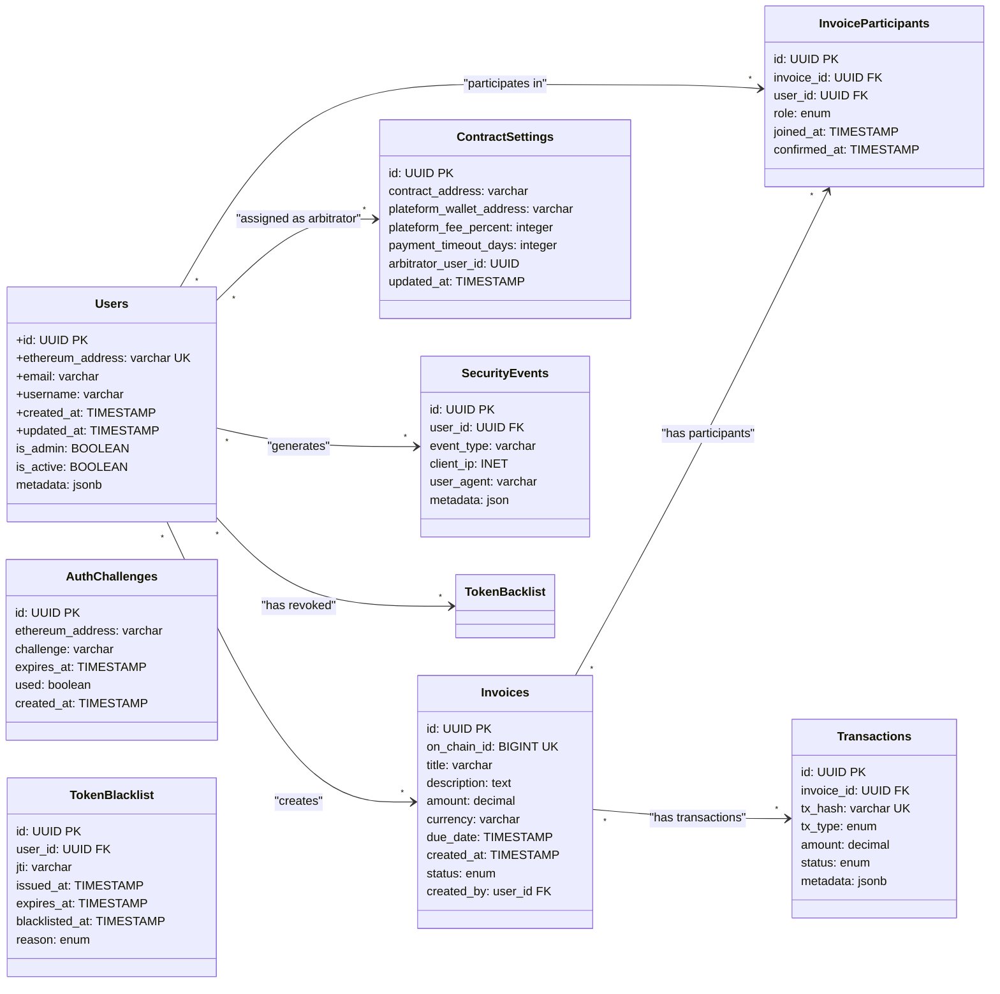

```mermaid
classDiagram
    direction LR
    class Users {
        +id: UUID PK
        +ethereum_address: varchar UK
        +email: varchar
        +username: varchar
        +created_at: TIMESTAMP
        +updated_at: TIMESTAMP
        is_admin: BOOLEAN
        is_active: BOOLEAN
        metadata: jsonb
    }

    class Invoices {
        id: UUID PK
        on_chain_id: BIGINT UK
        title: varchar
        description: text
        amount: decimal
        currency: varchar
        due_date: TIMESTAMP
        created_at: TIMESTAMP
        status: enum
        created_by: user_id FK
    }

    class InvoiceParticipants {
        id: UUID PK
        invoice_id: UUID FK
        user_id: UUID FK
        role: enum
        joined_at: TIMESTAMP
        confirmed_at: TIMESTAMP
    }

    class Transactions {
        id: UUID PK
        invoice_id: UUID FK
        tx_hash: varchar UK
        tx_type: enum
        amount: decimal
        status: enum
        metadata: jsonb
    }

    class AuthChallenges {
        id: UUID PK
        ethereum_address: varchar
        challenge: varchar
        expires_at: TIMESTAMP
        used: boolean
        created_at: TIMESTAMP
    }

    class ContractSettings {
        id: UUID PK
        contract_address: varchar
        plateform_wallet_address: varchar
        plateform_fee_percent: integer
        payment_timeout_days: integer
        arbitrator_user_id: UUID
        updated_at: TIMESTAMP
    }

    class SecurityEvents {
        id: UUID PK
        user_id: UUID FK
        event_type: varchar
        client_ip: INET
        user_agent: varchar
        metadata: json
    }

    class TokenBlacklist {
        id: UUID PK
        user_id: UUID FK
        jti: varchar
        issued_at: TIMESTAMP
        expires_at: TIMESTAMP
        blacklisted_at: TIMESTAMP
        reason: enum
    }

    Users "*" --> "*" Invoices : "creates"
    Users "*" --> "*" InvoiceParticipants : "participates in"
    Users "*" --> "*" TokenBacklist : "has revoked"
    Users "*" --> "*" SecurityEvents : "generates"
    Invoices "*" --> "*" InvoiceParticipants : "has participants"
    Invoices "*" --> "*" Transactions : "has transactions"
    Users "*" --> "*" ContractSettings : "assigned as arbitrator"

```
